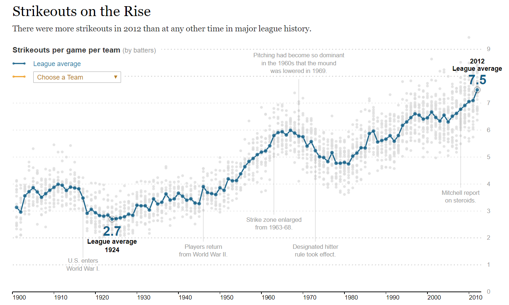

```{r setup, include=FALSE}
knitr::opts_chunk$set(echo = TRUE, message=F, warning=F)
library( dplyr )
library( pander )
```

#### [CPP 526: Foundations of Data Science I](https://ds4ps.org/cpp-526-fall-2019/)

<br>

*This lab introduces core plotting functions in order to create customized graphics in R.*


You can create a new RMarkdown file, or download the **LAB-03 RMD template**: 


[](https://www.dropbox.com/s/uz4m8bptbtip8x3/lab-03-template.rmd?dl=1)


--- 

<br><br>

## Replicating NYT Graphics

For this lab you will replicate the following [NYT Graphic](https://archive.nytimes.com/www.nytimes.com/interactive/2013/03/29/sports/baseball/Strikeouts-Are-Still-Soaring.html?_r=0&ref=baseball). 




<br>
<br>

## Functions 

You will use the following functions:

```{r, eval=F}
plot()  or plot.new() + plot.window()
points()
gray()
axis()
title()
text()
segments()
abline()
```


<br><br>

# Data

The data comes from the Lahman baseball data package. The **Teams** dataset contains season statistics for each baseball team from the late 1800s onward. The graph reports average strike-outs per game, which is calculated as **ave.so** below:


```{r load_data}
library( Lahman )
data( Teams )
ave.so <- Teams$SO / Teams$G
```


```{r, echo=F}
head( Teams )
```


<br>

You will need only the average strike-outs per game, and the year variables:

```{r}
ave.so <- Teams$SO / Teams$G  # average strike-outs per game each season 
year <- Teams$yearID
```


<br>

```{r, echo=T}
summary( ave.so ) %>% pander()
```

<br>

*Note that you don't have to understand baseball to make the graphic.*


<br><br>


# Lab Instructions

Your task is to replicate as closely as possible the graphic published by the NYT.

#### 1.	Plot average strike-outs by year. 

Use 1900 as the starting year for the graph and 2025 as the end point using the **xlim=c()** argument in the **plot.window()** function. 

```{r}
ave.so.min <- min( ave.so, na.rm=T )
ave.so.max <- max( ave.so, na.rm=T )

plot.new()
plot.window( xlim=c( 1920, 1980 ), ylim=c( ave.so.min, ave.so.max ) )
points( year, ave.so )
```


#### 2. Use the gray() function to select a shade of gray and add transparency to the points.

```{r}
ave.so.min <- min( ave.so, na.rm=T )
ave.so.max <- max( ave.so, na.rm=T )

plot.new()
plot.window( xlim=c( 1920, 1980 ), ylim=c( ave.so.min, ave.so.max ) )
points( year, ave.so, col=gray( level=0.2, alpha=0.1 ), pch=17, cex=3 )
```


#### 3. Add a year axis under your graph using the **axis()** function (try **side=1**). 

```{r}
plot.new()
plot.window( xlim=c( 1920, 1980 ), ylim=c( ave.so.min, ave.so.max ) )
points( year, ave.so, col=gray( level=0.2, alpha=0.1 ), pch=17, cex=3 )

axis( side=1 )
```

#### 4. Create grid lines for your y-axis using the **abline()** function. The argument **h=c()** allows you to specify the location of your horizontal lines.

```{r}
plot.new()
plot.window( xlim=c( 1920, 1980 ), ylim=c( ave.so.min, ave.so.max ) )
points( year, ave.so, col=gray( level=0.2, alpha=0.1 ), pch=17, cex=3 )

abline( h=c(3,4,5,6,7,8), lty=2, col="gray" )
```


#### 5. Using the **title()** function to add the main title "Strikeouts On the Rise" at the top.

```{r}
plot.new()
plot.window( xlim=c( 1920, 1980 ), ylim=c( ave.so.min, ave.so.max ) )
points( year, ave.so, col=gray( level=0.2, alpha=0.1 ), pch=17, cex=3 )
axis( side=1 )
title( main="some title" )
```


#### 6. The league average for each year is calculated for you below. Use the **points()** function to highlight the league trend line and the argument **type=“b”** to connect each year.  

```{r}
# create the league average vector
league.ave <- tapply( X=ave.so, INDEX=as.factor(year), FUN="mean", na.rm=T )
league.year <- as.numeric( names( league.ave ) )

plot.new()
plot.window( xlim=c( 1920, 1980 ), ylim=c( ave.so.min, ave.so.max ) )
points( year, ave.so, col=gray( level=0.2, alpha=0.1 ), pch=17, cex=3 )
points( league.year, league.ave, type="b", pch=8, col="red" )
```


#### 7.	Use the **text()** and **segments()** functions to reproduce at least two of the narrative texts from the graphic (“US enters World War I”, etc.). Note that a line break within text is created by including “\\n” in your string. 

For example:

```{r, eval=F}
text( x, y, text="Strike zone enlarged \nfrom 1963 to 1968." )
```


Your final plot should be as similar as possible to the NYT graphic!

<br><br>

## Hints

If you need help looking up arguments remember these two helpful functions:

```{r, eval=F}
args( abline )
help( abline )
```


<br>
<br>


# Submission Instructions

Login to Canvas at <http://canvas.asu.edu> and navigate to the assignments tab in the course repository. Upload your HTML file and RMD file to the appropriate lab submission link.

Remember to:

* name your files according to the convention: **Lab-##-LastName.Rmd**
* show your solution, include your code.
* do not print excessive output (like a full data set).
* follow appropriate style guidelines (spaces between arguments, etc.).

<br>
<br>

