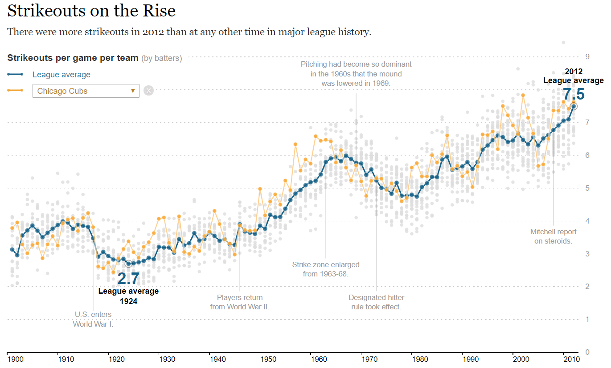

```{r setup, include=FALSE}
knitr::opts_chunk$set(echo = TRUE, message=F, warning=F)
```


#### [DS4PS](https://ds4ps.org/cpp-526-fall-2019/)

<br>

*This lab introduces the R Shiny package, which allows you to create dynamic graphics that ask for input from the user and change based upon the selection.*


This lab builds on the previous lab, but you will now add the drop-down menu similar to the original [NYT version](https://archive.nytimes.com/www.nytimes.com/interactive/2013/03/29/sports/baseball/Strikeouts-Are-Still-Soaring.html?_r=0&ref=baseball), and highlight season statistics from that team (the yellow line). 




<br>
<br>


## Dynamic Graphics

Shiny allows you to build interactive components in graphics or dashboards. The terms "dynamic" or "interactive" mean specifically that a set of widgets are used to gather user input, and that input changes the analysis or visualization accordingly. 

You can try it out using the Shiny Demo file or the example from the [Shiny tutorial](https://rmarkdown.rstudio.com/flexdashboard/shiny.html#loading_data): 

* [Shiny Demo](https://cdn.rawgit.com/DS4PS/Data-Science-Class/53c986f1/TEMPLATES/ShinyWidgetsDemo.Rmd) 
* [Tutorial App](https://cdn.rawgit.com/DS4PS/Data-Science-Class/b28db4b7/TEMPLATES/ShinyExample-01.Rmd) 

When you include "runtime: shiny" in the header, you do not need to load the shiny package in your document setup steps.

Note that running shiny creates an object called **input** which stores the values from your input widgets. Whatever you assign for the input widget ID will be the address for the value, which you can then access at **input$your_id**. 

```{r, eval=F}
selectInput( 
             inputId="my_widget_id",
             label="My Shiny Widget",
             choices=c("A","B","C"),
             selected="B"   
           )
```

Shiny automatically creates an object called "input" for you. When you create a widget, shiny will perform the folowing assignment implicitly in the background:

```{r, eval=F}
input$my_widget_id <- "B"  # user selected value
```

Before the user selects a value from the dropdown menu, the "*selected=*" argument specifies the default value. In this case, *input$my_widget_id* would store the value "B" by default. When the user makes a new selection, that value is updated with whatever option the user selected.

In the rest of your code, you can then reference the user input value at:

```{r, eval=F}
input$my_widget_id
```

<br>

#### Adding a Team Trend to the Graph

The solutions for last week's lab include an example of how you can add a specific team to the graph. It generalizes the team by using a generic **team.name** variable that stores the value. 

Note that in the subsequent code instead of using the specific team name for data steps and graphing functions it references the placeholder variable **team.name**. This enables you to change all of the team name references in one place, simplifying your code.

```{r, eval=F}
## TEAM NAME HARD-CODED: APPEARS MULTIPLE TIMES IN CODE

# adding season stats for the team:
dat.one.team <- filter( Teams, name == "Chicago Cubs" )
points( x=dat.one.team$yearID, y=dat.one.team$ave.so, 
        pch=20,  cex=1.2, col="goldenrod1", type="b" )

# adding the team name to the legend:
segments( x0=1900, y0=8.3, x1=1904, y1=8.32, col="goldenrod1", lwd = 1.5 )
points( x=c(1900,1904), y=c(8.3,8.3), col="goldenrod1", pch=20, cex=1.2 )
text ( x=1912, y=8.3, col="goldenrod1", labels="Chicago Cubs", cex=0.8 )


## GENERALIZED TEAM NAME:

team.name <- "Chicago Cubs"   # only place it appears

# adding season stats for the team:
dat.one.team <- filter( Teams, name == team.name )
points( x=dat.one.team$yearID, y=dat.one.team$ave.so, 
        pch=20,  cex=1.2, col="goldenrod1", type="b" )

# adding the team name to the legend:
segments( x0=1900, y0=8.3, x1=1904, y1=8.32, col="goldenrod1", lwd = 1.5 )
points( x=c(1900,1904), y=c(8.3,8.3), col="goldenrod1", pch=20, cex=1.2 )
text ( x=1912, y=8.3, col="goldenrod1", labels=team.name, cex=0.8 )
```


After you build your widget you can make the team selection dynamic by linking the user selection to your generic **team.name** variable. 

```{r, eval=F}
team.name <- input$my_widget_id  # input widget value
```


<br>
<br>


# Lab Instructions

This lab requires the following packages:

```{r, eval=F}
install.packages( "shiny" )
install.packages( "flexdashboard" )
```

Note that you need to install packages before starting your lab. You cannot include an install commands inside of your RMD file. 

You will likely use these packages as well:

```{r}
library( dplyr )
library( pander )
library( Lahman )
data( Teams )
```


Use the following template to complete this lab: 

[RMD Template](https://www.dropbox.com/s/lfw91ev0fl182n3/lab-04-template.rmd?dl=1)


<br><br>

### Step (1)	

**In the provided template, place your code from last week into the code chunk with the renderPlot() function:**

```{r, eval=F}
renderPlot({
  
# your code here
  
})
```

### Step (2) 

**Create a user-input widget on the left side bar by adding the proper values to these arguments:**

```{r, eval=F}
selectInput( inputId=,   # creates slot in input to hold values: input$your_inputId
             label=,     # title of the input widget
             choices=,   # options for the user
             selected=   # set the default option
           )
```

Note that "choices=" will determine the teams visible in the drop-down box. You will be selecting from baseball team names.

* Use the variable "name" in the dataset instead of teamID since it is more user-friendly.  
* Find a reasonable way to select specific teams so that you are only using 10-25 team names in the drop-down menu (see below for hints).  
* Combine your preferred teams into a character vector: **choices=c("team1","team2",...,"teamN")**.

### Step (3) 

**Similar to the NYT graphic, add the team trend line to the graphic in orange.**

Note that you would add a single team to the graphic something like this: 

```{r, eval=F}
Teams$ave.so <- Teams$SO / Teams$G  # to make subsetable, add back to data frame
one.team <- filter( Teams, name == "Cincinnati Reds" )
points( x=one.team$yearID, y=one.team$ave.so, type="b", pch=19, col="darkorange4" )
```

This code will also go inside the renderPlot() function in Step 1. You first need to replace the specific team name with the generalized input value from your selectInput() widget. 


<br>
<br>


**Notes on identifying team unique names.**

Note there are `r length(unique(Teams$name))` unique team names in the dataset:

```{r}
unique( Teams$name ) %>% head()
unique( Teams$name ) %>% length()
```

You do NOT want to use "choices=Teams$name" for the argument because each team name is repeated multiple times. This drop-down box would then have several thousand choices.

Instead select 10-25 teams, and include their full name in the choices list only once.

You might favor teams that have longer trend lines. The Cincinnati Reds and Pittsburgh Pirates have been in the dataset from the beginning, and the rest of the teams have been added along the way. 

This table reports the total number of seasons they have each appeared:

```{r}
Teams %>%
  count( name ) %>%
  arrange( - n ) %>% 
  head( 10 ) %>%
  pander()
```

 Some of these professional baseball teams you might not recognize because they only lasted for a short time:


```{r}
Teams %>%
  count( name ) %>%
  arrange( - n ) %>% 
  tail( 10 ) %>%
  pander()
```


<br>
<br>


# Submission Instructions

**Submit your RMD file but no HTML file this time.** When you include "runtime: shiny" in your header, it launches a real-time app instead of generating an HTML file that can be shared.

Remember to:

* name your files according to the convention: **Lab-##-LastName.Rmd**
* show your solution, include your code.
* do not print excessive output (like a full data set).
* follow appropriate style guidelines (spaces between arguments, etc.).

<br>
<br>


