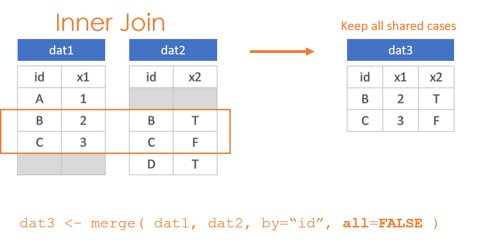

```{r setup, include=FALSE}
knitr::opts_chunk$set(echo = TRUE, message=F, warning=F)
library( dplyr )
library( pander )
```

#### [DS4PS](https://ds4ps.github.io//cpp-526-fall-2019/)

<br>

This lab demonstrates the process of joining two datasets through a **merge()** function. This is one of the most common and most important processes in data science, because it allows you to combine multiple datasets to link observations that pertain to the same individuals / cases. The deepest insights often come from bringing data together in this way.

We will use the following packages for the lab:

```{r, eval=F}
library( dplyr )
```

You can create a new RMarkdown file, or download the lab template: 

[RMD Template](https://cdn.rawgit.com/DS4PS/Data-Science-Class/c464d527/TEMPLATES/MarkdownTemplateSimple.Rmd)

<br><br>

# Overview of Joins

<br>

## Inner, Outer, Left and Right

There are two things to remember when conducting joins. The first is that when you merge two datasets it is rare for them both to contain the exact same observations. As a result, you need to make decisions about which data to keep and which data to drop post-merge. There are four options:

* Keep everything: "Outer Join"
* Keep only observations in both datasets: "Inner Join"
* Keep all observations from dat1: "Left Join"
* Keep all observations from dat2: "Right Join"

<br>

```{r, fig.cap="", echo=F, out.width='40%', fig.align='center' }
knitr::include_graphics( "images/shared_observations.png" )
```

<br>

These options are specified through the *all=*, *all.x=*, and *all.y=* arguments in the **merge()** function, where the arguments all.x stands for observations in dat1, and all.y stands for observations in dat2 in this example.


```{r, fig.cap="", echo=F, out.width='80%', fig.align='center' }
knitr::include_graphics( "images/outer_join.png" )
```

<br>

```{r, fig.cap="", echo=F, out.width='80%', fig.align='center'}

```

<br>

```{r, fig.cap="", echo=F, out.width='80%', fig.align='center' }
knitr::include_graphics( "images/left_join.png" )
```

<br>

```{r, fig.cap="", echo=F, out.width='80%', fig.align='center' }
knitr::include_graphics( "images/right_join.png" )
```

<br>

And the equivalent operations in **dplyr**:


 
<br><br>

## Compound IDs

It is often the case where a single ID does not unique specify observations needed to join data. For example, if you are looking at the relationship between employee eye color and their height, these are both variables that can only have one value per employee, so the employee ID would be sufficient to merge the eye color and height datasets.

If we want to look at the relationship between employee sick days in a given year and their performance, we now might have multiple years of data for each employee. To merge these two datasets we need to use both ID and YEAR. This is an example of a compound ID - two or more variables are needed to create a unique key for the join.

```{r, fig.cap="", echo=F, out.width='60%', fig.align='center' }
knitr::include_graphics( "images/compound_ids.png" )
```


Consider an example where sales representatives get a bonus if they sell over $10,000 in subscriptions each year. We have one database generated by the sales department, and another generated by HR. We want to merge them to ensure bonuses have been properly issued. The data tables are structured as follows:

```{r, echo=F}
id <- c("A","A","B","B","C","C")
year <- c(2001,2002,2001,2002,2001,2002)
sales <- c(54000,119000,141000,102000,66000,68000)
bonus <- c("$0","$10,000","$10,000","$10,000","$0","$0")

dat1 <- data.frame( id, year, sales )
dat2 <- data.frame( id, year, bonus )
dat1 %>% pander()
dat2 %>% pander()
```


The RIGHT way to merge these tables is to specify the set of IDs that allow you to indentify unique observations. The employee ID is not sufficient in this case because there are separate observations for each year. As a result, 

```{r}
merge( dat1, dat2, by=c("id","year") )         %>% pander()
```


The WRONG way to merge these two datasets is to use only the employee ID. In this case, since the rows are now no longer unique, the only choice the merge() function has is to join EVERY instance on the right to each instance on the left. It has the effect of blowing up the size of the database (notice we have increased from 6 to 12 rows), as well as duplicating fields and incorrectly aligning data.

Row number 2, for example, reports that employee A received a bonus on $54,000 in sales.

```{r}
merge( dat1, dat2, by="id" )         %>% pander()
```

The solution is to ensure you are using the combination of keys that ensures each observation is correctly specified. 

<br><br>

## Merge Keys

Your "keys" are the shared IDs across your datasets used for the join. You can check for shared variable names by looking at the intersection of column names in both datasets:

```{r}
intersect( names(dat1), names(dat2) )
```

This works when the datasets were generated from a common system that uses standardized and identical ID names. In other cases, the same key may be spelled differently ('year' vs. 'YEAR') or have completely different names. 

The check above at least allows you to catch instances where variable names would be repeated, and thus duplicated in the merged file. When this happens, like the 'year' variable in the example above, the merge operation will add an 'x' and 'y' to the end of the variable names to specify which dataset they originated from ('year.x' and 'year.y' in the example above). 

In instances where variable names differ, you can specify the names directly using "by.x=" and "by.y=":

```{r, eval=F}
merge( dat1, dat2, by.x="fips", by.y="FIPS" ) 
```


<br><br>

## In Summary

You will be using the merge() function in this lab to join datasets. You need to specify two arguments in each merge call.

```{r, eval=F}

merge( dat1, dat2, by="", all="" )
```


Your IDs used to join dataset:

* Use "by=" when variable names are identical
* Use "by.x=" and "by.y=" when the variable names are spelled differently
* Remember the c() when you have a compound key:  by=c("FIPS","YEAR")

Specify an outer, inner, left, or right join:

* all=TRUE creates an outer join
* all=FALSE creates an inner join
* all.x=TRUE creates a left join
* all.y=TRUE creates a right join


<br><br>

# Data

This week's lab uses the Lahman baseball dataset. 

```{r}
library( Lahman )
data( People )
data( Batting )
data( Salaries )
data( Teams )
```


We are interested in identifying the teams that have achieved the largest number of wins on the smallest budgets. Who are the teams that have far outperformed their resource constraints? 

This analysis requires us to link two tables from Lahman - the Salaries table for pay, and the Teams table for total wins per season. Our outcome of interest will be the cost of each win that a team earns in a season. 


If we are comparing salaries across several decades, it is important to adjust salaries for inflation so that everything is in 2016 dollars. For simplicity sake we are assuming steady 3% inflation each year since 1985. Tranform the raw numbers and save the variable as **salary.adj**. 

```{r}
# adjust old salaries for inflation
# to convert all salaries into 2016 dollars
# assuming a 3 percent inflation each year 
Salaries <- 
  Salaries %>% 
  mutate( salary.adj = salary*(1.03)^( max(yearID) - yearID ) )

head( Salaries ) %>% pander()
```


Total wins for each season are reported in the **Teams** table:

```{r}
head( Teams ) %>% pander()
```

Note that the **Salaries** table records data using people as the unit of analysis, and **Teams** records data using teams as the unit of analysis. In order to merge these tables you will first need to convert people salaries into aggregate team salaries or team budgets. 

Follow these steps to build your dataset:

1. Aggregate salaries by team and year into a total salaries variable (group_by + summarize). 
2. Include a count of players per team each season. 
3. Merge the Teams dataset with your new team salaries table using both **teamID** and **yearID** as unique keys. 
4. Create a new variable that measures the cost of each win for each team, by season.
5. Filter the results to retain only teams that have at least 25 teams on their roster each year. 
6. Sort your list and report the teams with the lowest cost per win. 

Your table will look something like this (this table not sorted to show the moneyball teams). 


```{r, echo=F}

Salaries <- 
  Salaries %>% 
  mutate( salary.adj = salary*(1.03)^( max(yearID) - yearID ) )

teamSalaries <- 
  Salaries %>% 
  group_by( yearID, teamID ) %>%
  summarize( team.budget = sum( salary.adj, na.rm=T ), n=n() )


Teams <- merge( Teams, teamSalaries )

Teams %>% 
  filter( n > 25 ) %>%
  mutate( cost.per.win = (team.budget / W )/100000 ) %>%
  # arrange( cost.per.win ) %>% 
  select( yearID, teamID, lgID, Rank, G, W, n, team.budget, cost.per.win ) %>%
  head( 25 )

```


Notes:

* **n** represents the number of players where salaries were available. Data was not available for all players in all seasons, so we filter by n > 25 to ensure we have a reliable estimate of the team's budget that year. 
* **cost.per.win** is represented in hundreds of thousands of dollars here for simplicity. (wins / (budget/100000) )  
* **Rank** is from Teams, and is their final league ranking at the end of the season. 

<br>

If you are interested in some of the actual math behind Moneyball ("Sabermetrics") that breaks open the black box of each season to figure out what types of players to recruit to maximize wins, you should check out [this nice blog](https://towardsdatascience.com/linear-regression-moneyball-part-1-b93b3b9f5b53) or this [R book](https://www.amazon.com/Analyzing-Baseball-Data-Second-Chapman/dp/0815353510) on baseball statistics. 


<br><br>

# Submission Instructions

After you have completed your lab, knit your RMD file. **Submit your code and a printed view of your final table.**

Login to Canvas at <http://canvas.asu.edu> and navigate to the assignments tab in the course repository. Upload your RMD and your HTML files to the appropriate lab submission link.

Remember to:

* name your files according to the convention: **Lab-##-LastName.Rmd**
* show your solution, include your code.
* do not print excessive output (like a full data set).
* follow appropriate style guidelines (spaces between arguments, etc.).
